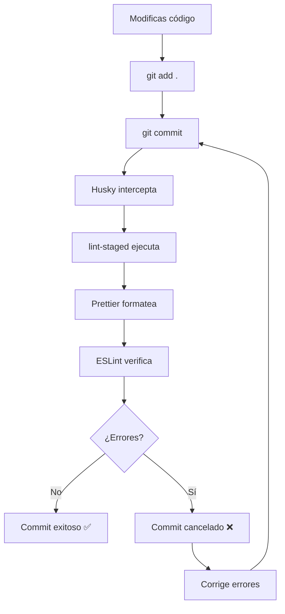

# Configuración de Desarrollo - Prettier, ESLint y Husky

## 🛠️ Herramientas Instaladas

### ✨ Prettier

Formateador de código automático que mantiene un estilo consistente.

**Comandos disponibles:**

```bash
npm run format          # Formatea todo el código
npm run format:check    # Verifica formatting sin cambios
```

### 🔍 ESLint

Analizador de código que detecta problemas y mantiene la calidad del código.

**Comandos disponibles:**

```bash
npm run lint           # Analiza el código por problemas
npm run lint:fix       # Corrige problemas automáticamente
```

### 🪝 Husky

Hooks de Git que ejecutan scripts automáticamente en eventos de Git.

**Configurado para:**

- **Pre-commit**: Ejecuta prettier y eslint automáticamente antes de cada commit
- Formatea archivos modificados
- Corrige errores de linting automáticamente

## 📁 Archivos de Configuración

### `.prettierrc`

Configuración de Prettier con las siguientes reglas:

- Semi-colons activados
- Comillas simples
- Trailing commas en ES5
- Ancho de línea: 80 caracteres
- Tab width: 2 espacios

### `.prettierignore`

Archivos y carpetas que Prettier debe ignorar:

- node_modules, dist, build
- Archivos de configuración del sistema
- Logs y cache

### `eslint.config.js`

Configuración de ESLint integrada con:

- TypeScript support
- React hooks rules
- Prettier integration
- React Refresh plugin

## 🚀 Uso Diario

### Desarrollo Normal

1. Escribe tu código normalmente
2. Los hooks de Git se ejecutarán automáticamente al hacer commit
3. Si hay errores, el commit se cancelará hasta que se corrijan

### Comandos Manuales

```bash
# Formatear código manualmente
npm run format

# Revisar problemas de linting
npm run lint

# Corregir problemas de linting automáticamente
npm run lint:fix
```

### Pre-commit Hook

Cuando hagas `git commit`:

1. Husky interceptará el commit
2. lint-staged ejecutará prettier y eslint en archivos modificados
3. Si todo está bien, el commit continuará
4. Si hay errores, el commit se cancelará

## 🔄 Flujo de Trabajo Automático



## 💡 Consejos

1. **Configura tu editor** para formatear al guardar con Prettier
2. **Instala extensiones** de VS Code para Prettier y ESLint
3. **No ignores los errores** de ESLint, úsalos para mejorar tu código
4. **Los hooks son automáticos**, no necesitas recordar ejecutar comandos

¡Tu proyecto ahora tiene un flujo de trabajo de desarrollo profesional! 🎉
