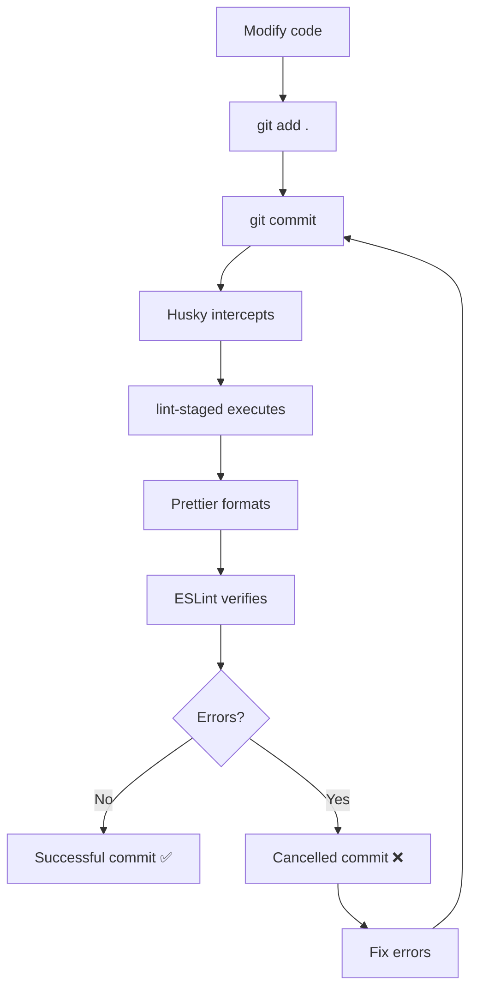

# Development Configuration - Prettier, ESLint and Husky

## 🛠️ Installed Tools

### ✨ Prettier

Automatic code formatter that maintains consistent style.

**Available commands:**

```bash
npm run format          # Formats all code
npm run format:check    # Checks formatting without changes
```

### 🔍 ESLint

Code analyzer that detects problems and maintains code quality.

**Available commands:**

```bash
npm run lint           # Analyzes code for problems
npm run lint:fix       # Fixes problems automatically
```

### 🪝 Husky

Git hooks that execute scripts automatically on Git events.

**Configured for:**

- **Pre-commit**: Runs prettier and eslint automatically before each commit
- Formats modified files
- Fixes linting errors automatically

## 📁 Configuration Files

### `.prettierrc`

Prettier configuration with the following rules:

- Semi-colons enabled
- Single quotes
- Trailing commas in ES5
- Line width: 80 characters
- Tab width: 2 spaces

### `.prettierignore`

Files and folders that Prettier should ignore:

- node_modules, dist, build
- System configuration files
- Logs and cache

### `eslint.config.js`

ESLint configuration integrated with:

- TypeScript support
- React hooks rules
- Prettier integration
- React Refresh plugin

## 🚀 Daily Usage

### Normal Development

1. Write your code normally
2. Git hooks will run automatically when committing
3. If there are errors, the commit will be cancelled until they are fixed

### Manual Commands

```bash
# Format code manually
npm run format

# Check linting problems
npm run lint

# Fix linting problems automatically
npm run lint:fix
```

### Pre-commit Hook

When you do `git commit`:

1. Husky will intercept the commit
2. lint-staged will run prettier and eslint on modified files
3. If everything is fine, the commit will continue
4. If there are errors, the commit will be cancelled

## 🔄 Automatic Workflow



## 💡 Tips

1. **Configure your editor** to format on save with Prettier
2. **Install extensions** for VS Code for Prettier and ESLint
3. **Don't ignore ESLint errors**, use them to improve your code
4. **Hooks are automatic**, you don't need to remember to run commands

Your project now has a professional development workflow! 🎉
